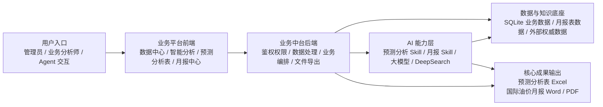

# AnalysisAgent 简版整体架构图（领导汇报版）

## 一句话说明

AnalysisAgent 以“数据底座 + AI 能力 + 业务平台”的方式运行：  
前端承接业务操作，后端负责权限、编排和导出，AI 层负责生成预测分析表与国际油价月报，最终输出可直接交付的 Excel、Word 和 PDF 成果。

## 领导视角的 6 个关键点

1. **面向业务交付**：不是单纯的分析工具，而是直接产出可交付成果。
2. **双核心产出**：预测分析表 + 国际油价月报。
3. **AI 深度融入**：大模型不是外挂，而是预测与月报生成核心引擎。
4. **数据驱动**：平台基于内部结构化数据与外部权威信息源协同工作。
5. **人机协同**：AI 先生成，分析师再在线校准与修订。
6. **可管可控**：支持用户权限、页面权限、数据隔离与日志监控。
