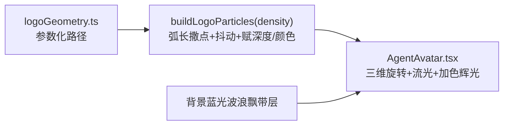

## 一、Logo 形态特点总结（设计依据）

基于 `frontend/public/logo.jpg` 与目标参考 `frontend/public/goodRslt.png` 提炼：

- 外圈：一个开口朝右的粗 "C" 形大圆环（地球/海洋意象）。
- 内圈：圆环内部一个较小的圆环（内 "O")。
- 钻塔：正上方中央一根细高三角尖塔（海上钻井平台），是全图最高、最靠前的标志性元素。
- CN 折线：中心由红色折线构成的角形 "N/人" 笔画，与内圈交叠。
- 海浪飘带：底部 3 条平行弧形蓝色波带（海浪），由左下扫向右。
- 文字：右侧 "CNOOC" 方块字。
- 目标观感（参考 goodRslt.png）：纯蓝白单色调、加色发光、深色背景不发灰、整体流光、形态清晰、密度适中。

## 二、核心方案变更

旧实现 `frontend/src/utils/logoParticles.ts` 从 `/goodRslt.png`（已渲染粒子图）二次采样，导致密度不均、亮度叠加失真、背景蓝波干扰前景识别（发灰、形态不清的根因）。

新方案：完全程序化定义几何 → 沿路径按弧长等距撒点（密度可控）→ 渲染。不加载/采样任何图片。

## 三、几何模块（新建 `frontend/src/utils/logoGeometry.ts`）

在归一化坐标 `[-1,1]` 空间用参数化函数描述各部件，每条路径带元数据 `{ role: 'edge'|'fill', depth, colorRole }`：

- `arc(cx,cy,r,a0,a1)`：外圈大 C（开口右侧）、内圈 O。
- `polyline([...])`：钻塔三角尖塔、CN 折线。
- `ribbon(p0,c0,c1,p1,width)`：3 条贝塞尔海浪带（构成 logo 底部波带）。
- `glyphs('CNOOC')`：用粗笔段拼出右侧方块文字。

深度分层（旋转时产生立体感，值越大越靠前）：
- 钻塔尖塔：最前（depth 最高，白热）
- CN 折线 / 内圈：中前
- 外圈 C：中
- 海浪带 / CNOOC 文字：后

`buildLogoParticles(density)`：对每条路径按弧长间隔撒点（间隔由 `density` 决定，保证密度≈参考图、不过密），加入垂直抖动形成"带宽"，边缘点标 `edge`、填充点标 `fill`，赋 `size/alpha/intensity/phase/orbit`。

## 四、粒子构建模块（重写 `frontend/src/utils/logoParticles.ts`）

- 删除图片加载与像素采样逻辑（`loadLogoParticles`/`sampleLogoParticles`/`isLogoColor` 等）。
- 改为同步导出 `buildLogoParticles(density?)`，内部调用 `logoGeometry`。
- 颜色统一蓝白单色：`edge` → 白/青白高光，`fill` → 电光蓝梯度（丢弃红色），保证深底高亮不发灰。
- 用单一 `density` 参数控制全局密度（替代旧的 `edgeCount/fillCount` 魔法数）。

## 五、渲染重写（`frontend/src/components/AgentAvatar.tsx`）

- 改同步构建：`useEffect` 内调用 `buildLogoParticles()` 而非 `loadLogoParticles().then()`。
- 背景蓝光波浪飘带（需求6）：新增 `drawWaveRibbons(ctx,now)` 背景层，深蓝→电光蓝半透明正弦丝带，缓慢飘动、柔和模糊，在粒子之前以 `source-over` 绘制。
- 真三维：绕 Y 轴呼吸式偏转 + 轻微俯仰 + 透视投影 + 按深度排序；按深度调节尺寸/透明度/模糊，幅度比现状更大但保持正面可读（往复摆动而非整圈旋转）。
- 加色辉光：`globalCompositeOperation='lighter'`，每粒子 = 白热核心 + 彩色光晕，整体高亮、深底不发灰。
- 流光扫掠（参考 logoDemo）：1-2 条对角移动亮带，扫过的粒子瞬时增亮，保留并强化现有 sweep 逻辑。
- 保留 mood 响应：`visual.particle_speed / glow_intensity / pulse_rate` 驱动速度、辉光、呼吸。

## 六、配置/样式微调

- `frontend/src/types/agentVisual.ts`：`DEFAULT_VISUAL.colors` 改为蓝白单色（如 `['#eaf6ff','#3fa0ff','#0a4fce']`）；`LogoParticle` 增加 `role`/`depth` 等字段（如需要）。
- `frontend/src/index.css` `.agent-avatar-canvas`：微调 drop-shadow 辉光强度配合新亮度。
- 使用方 `FloatingAgent.tsx`(288x192) 与 `AgentChat.tsx`(48) 接口不变。

## 七、密度校准（需求7）

`density` 默认值经验调到边缘粒子总量约 3000–4000、整体观感接近 `goodRslt.png`：既能清晰辨认 logo 形态，又不过密。后续按实际渲染微调常量。