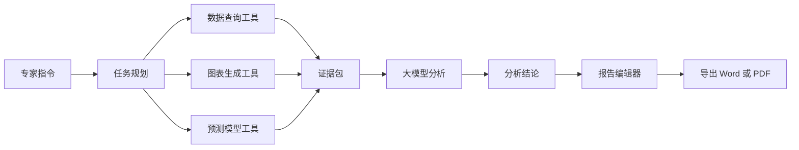
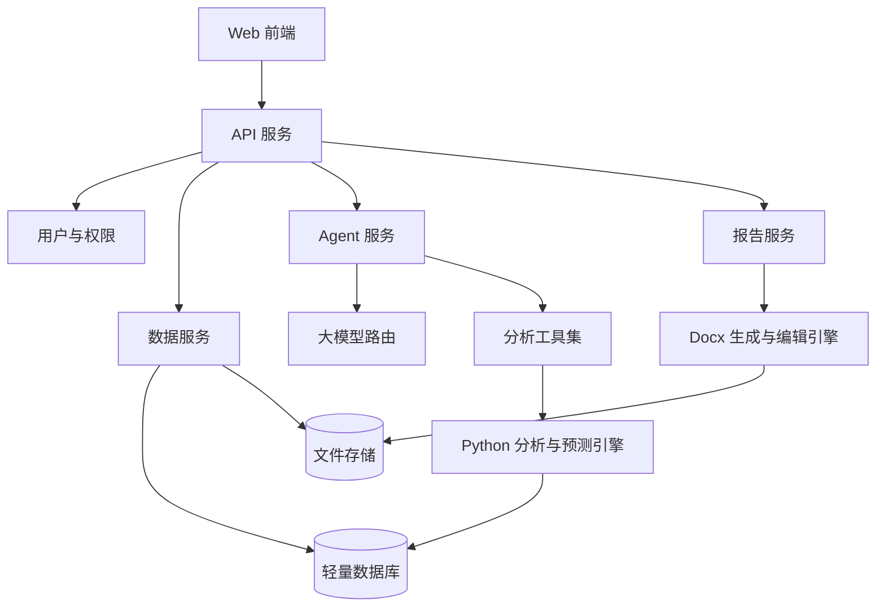
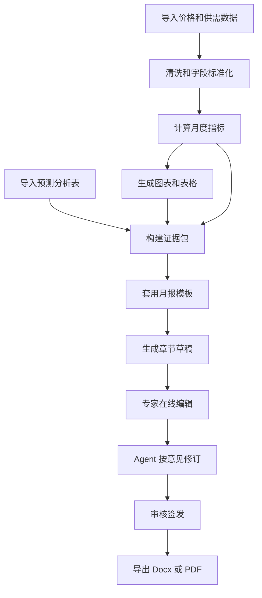

# 能源行业 AI 数据分析平台详细设计方案

## 1. 项目定位

本平台定位为“能源行业专家的 AI 数据分析与报告生成工作台”，面向国际油价、供需平衡、宏观金融、地缘事件、机构预测等多源数据，提供数据入库、可视化探索、智能分析、预测建模、周报/月报生成与在线编辑能力。

需求来源：
- [README.MD](C:/Users/052000/Desktop/AnalysisAgent/README.MD)：定义 CSV 数据加载、可视化、Agent 分析、周报/月报生成、轻量数据库、可迁移部署等核心要求。
- [logo.jpg](C:/Users/052000/Desktop/AnalysisAgent/logo.jpg)：红蓝企业视觉符号，可作为整体品牌色和拟人化 Agent 入口的视觉基础。
- [yuebao](C:/Users/052000/Desktop/AnalysisAgent/yuebao)：包含油价月报 Word 样例、油价预测分析表、原油价格表、供需平衡表，适合作为报告模板、数据字段和图表生成规则的样例来源。

样例月报抽取到的核心结构：
- 封面信息：中国海油集团能源经济研究院、国际油价月报、期号、日期、部门。
- 内容摘要：当月油价走势、核心驱动因素、下月展望。
- 一、原油市场回顾：期货市场、现货市场、价格走势、价差、持仓结构。
- 二、国际油价影响因素：宏观经济、石油需求、石油供应、库存、美元/美联储、地缘局势、持仓/投机因素。
- 三、国际油价展望：情景分析、研讨会预测、模型预测、机构预测、综合结论。
- 附属元素：图表编号、数据来源、预测表、审核/签发信息。

样例数据抽取到的核心类型：
- 原油价格表：WTI、Brent、阿曼、沪原油、迪拜、DTD、米纳斯、塔皮斯、杜里等日频价格和月均/周均/环比指标。
- 供需平衡表：IEA、EIA、S&P 等机构对季度供应、需求、供需差的预测。
- 油价预测分析表：宏观金融、美元汇率、美股、美债、基金持仓等影响因素，包含重要性评分、形势判断、对油价影响方向。

## 2. 产品功能设计

### 2.1 首页与专家工作台

首页采用未来科技简约风，使用深色或低饱和浅色背景、毛玻璃卡片、红蓝品牌色点缀。核心区域包括：
- 顶部导航：数据中心、智能分析、预测模型、报告中心、系统设置。
- 全局概览：Brent/WTI 最新价格、月均价、环比、主要价差、供需差、预测区间。
- Agent 入口：以粒子化企业 logo 作为“能源分析助手”入口，参考 hashgraphvc.com 的粒子聚合/扩散效果。
- 快捷任务：生成本月油价月报、分析 Brent 走势、比较机构预测、导入 CSV、更新数据源。

### 2.2 数据可视化

围绕样例月报中的图表进行产品化沉淀：
- 价格走势：Brent、WTI、Dubai、Oman、DTD 等时间序列折线图。
- 价差分析：Brent-WTI、Brent-Dubai、Brent-ESPO、期现价差。
- 供需平衡：供应、需求、供需差按机构和季度对比。
- 宏观金融：美元指数、美债收益率、PMI、GDP 预测、基金持仓。
- 预测对比：专家研讨会、模型预测、S&P、Wood Mackenzie、Rystad 等机构预测对比。
- 事件标注：地缘冲突、OPEC+ 会议、美联储议息、库存数据公布等事件叠加在价格图上。

每张图表都应支持：时间范围筛选、品种/机构筛选、数据来源展示、导出图片、插入报告。

### 2.3 Agent 智能分析

Agent 采用“可选大模型 + 工具调用 + 行业技能”的结构：
- skill1 数据预测：调用预测模型，输出价格点预测、区间预测、情景预测。
- skill2 数据分析：读取结构化数据，生成趋势、环比、同比、价差、异常波动解释。
- skill3 月报/周报生成：根据模板、图表、数据和专家要求生成报告草稿。

Agent 典型任务：
- “分析 2026 年 5 月 Brent 油价上涨的主要原因，并生成三张图。”
- “对比 IEA、EIA、S&P 对二季度供需差的预测变化。”
- “按现有月报格式生成 2026 年 6 月国际油价月报初稿。”
- “把这段结论改得更适合领导汇报，保留数据依据。”

Agent 工作流：

### 2.4 报告中心与在线编辑

报告中心以样例“国际油价月报”为第一版模板，支持：
- 模板管理：国际油价月报、周报、专题分析报告。
- 章节生成：内容摘要、市场回顾、影响因素、情景预测、机构预测、结论。
- 图表插入：从可视化模块选择图表，自动编号为“图1-1”“表3-2”。
- 数据来源脚注：自动带出 CNEEI、ICE、Platts、S&P、IMF 等来源。
- 在线编辑：嵌入富文本/Doc 编辑器，专家可人工修改，Agent 可按选区改写。
- 审核流：执笔、初审、审核、签发字段可配置。
- 导出：docx、pdf、图片包、数据附件。

报告生成应使用“结构化中间稿”，而不是直接让大模型一次性写完整 Word：
- ReportOutline：标题、期号、日期、章节列表。
- EvidencePack：每个章节引用的数据、图表、指标和来源。
- DraftBlocks：每段正文、图表说明、表格说明。
- ReviewComments：专家修改意见和 Agent 修改记录。

## 3. 系统架构设计

推荐采用前后端分离 + Python 分析服务 + 轻量数据库的架构。

### 3.1 前端设计

建议技术栈：
- Vite + React + TypeScript：轻量、启动快、生态成熟。
- Tailwind CSS 或 UnoCSS：便于实现毛玻璃、科技感布局。
- ECharts 或 AntV：适合金融/能源时间序列和多指标图表。
- Tiptap、Milkdown 或 OnlyOffice 集成：用于在线报告编辑。
- Three.js 或 tsParticles：实现 logo 粒子化 Agent 入口。

前端页面：
- Dashboard：价格、供需、预测、事件总览。
- DataCenter：CSV 上传、数据预览、字段映射、入库记录。
- Analysis：专家指令输入、Agent 分析结果、图表联动。
- Forecast：模型预测、情景配置、结果回测。
- ReportCenter：月报列表、模板管理、在线编辑、导出。
- Settings：模型选择、数据源配置、权限管理。

logo 视觉建议：
- 主色：深蓝作为信任与能源工业底色，红色作为风险、价格波动和智能入口强调色。
- 粒子效果：默认聚合成企业 logo，鼠标悬停时粒子轻微漂移，点击后展开为 Agent 对话面板。
- 拟人化方式：不直接做卡通形象，采用“会呼吸的粒子 logo + 对话光环 + 状态提示”，更符合企业级专业场景。

### 3.2 后端设计

建议技术栈：
- Python FastAPI：适合数据分析、机器学习、异步任务和接口开发。
- Pandas / Polars：CSV、Excel、时间序列数据处理。
- scikit-learn / statsmodels / Prophet / XGBoost：第一阶段预测模型。
- LangChain 或自研轻量 Agent 工具编排：连接不同大模型和内部工具。
- python-docx / docxcompose：Word 模板填充、报告导出。

后端服务划分：
- data-service：数据上传、解析、字段映射、清洗、版本管理。
- analytics-service：指标计算、同比环比、价差、异常检测、图表数据接口。
- forecast-service：模型训练、预测、回测、情景预测。
- agent-service：大模型路由、工具调用、提示词模板、上下文管理。
- report-service：报告模板、章节生成、在线编辑内容保存、docx/pdf 导出。
- file-service：图片、docx、csv/xlsx 原始文件和导出文件管理。

### 3.3 数据库与文件存储

第一阶段推荐 SQLite + 本地文件存储，满足轻量部署和迁移：
- SQLite：结构化数据、任务记录、报告元数据、模型配置。
- DuckDB：可选，用于大 CSV/Excel 的本地分析加速。
- 本地对象目录：保存上传文件、生成图表、导出 docx/pdf。

后续扩展：
- PostgreSQL：多用户、权限、并发增强。
- MinIO/S3：统一保存图片、文档、原始数据。
- Wind/API 数据接入：通过定时任务落库，保留数据版本。

核心数据表建议：
- datasets：数据集元信息、来源、上传时间、字段 schema。
- price_series：品种、日期、价格、单位、数据来源。
- balance_forecasts：机构、更新时间、季度、供应、需求、供需差。
- factor_assessments：影响因素、重要性、判断文本、影响方向、月份。
- forecast_results：模型、预测周期、基准/高/低情景、置信区间。
- report_templates：模板结构、章节定义、占位符。
- reports：报告实例、期号、状态、作者、审核人、文件路径。
- agent_runs：专家指令、工具调用、证据、输出、耗时、模型。

## 4. 数据处理与预测设计

### 4.1 数据导入流程

第一阶段支持 CSV/XLSX：
- 上传文件。
- 自动识别表头、日期列、指标列、单位。
- 专家确认字段映射。
- 数据质量检查：缺失值、重复日期、异常波动、单位不一致。
- 入库并生成数据版本。

### 4.2 指标计算

围绕月报常用指标沉淀计算能力：
- 价格：日均、周均、月均、环比、同比、最大值、最小值、波动率。
- 价差：期现价差、区域价差、不同油种价差。
- 供需：供应、需求、供需差、机构预测修正幅度。
- 预测：基准/乐观/悲观或高/低情景，机构预测偏差。
- 事件：事件前后价格变化、窗口收益、波动放大倍数。

### 4.3 预测模型

第一阶段采用可解释、易维护模型：
- 基准模型：移动平均、ARIMA/SARIMAX、Prophet。
- 机器学习模型：XGBoost/LightGBM，输入价格、库存、美元、PMI、供需差、持仓、事件变量。
- 情景预测：专家设定地缘、供需、美元、库存假设，模型输出区间。
- 回测：按月滚动回测，展示误差 MAE、MAPE、方向准确率。

预测结果必须输出“数值 + 依据 + 不确定性”：
- Brent 月均价预测。
- 高/低情景区间。
- 核心驱动因素权重。
- 与专家研讨会和机构预测的差异。

## 5. Agent 与大模型设计

### 5.1 模型路由

支持按需求选择大模型：
- 通用写作模型：用于报告生成、语言润色。
- 推理模型：用于复杂归因、情景分析。
- 私有化模型：用于内网部署和敏感数据保护。
- Embedding 模型：用于历史报告检索和知识库问答。

配置维度：模型供应商、模型名称、API Key、上下文长度、温度、是否启用工具调用、是否允许联网。

### 5.2 工具调用

Agent 不直接猜数据，必须通过工具获取证据：
- query_price_series：查询价格序列。
- calc_spread：计算价差。
- query_balance_forecast：查询供需预测。
- query_factor_assessment：读取预测分析表中的因素判断。
- run_forecast_model：运行预测模型。
- generate_chart：生成图表配置和图片。
- draft_report_section：生成章节草稿。
- revise_doc_selection：根据专家意见修改选中文本。

### 5.3 可信输出机制

为降低幻觉风险：
- 所有数字必须来自数据表、模型结果或人工输入。
- 报告正文的关键结论附带 EvidencePack。
- 图表标题、编号、来源自动生成。
- Agent 输出中区分“数据事实”“模型预测”“专家判断”。
- 重要报告生成后进入人工审核状态，不直接签发。

## 6. 月报生成详细流程

月报模板应内置以下章节：
- 内容摘要。
- 一、上月原油市场回顾。
- （一）期货市场回顾。
- （二）现货市场回顾。
- 二、本月国际油价影响因素。
- （一）全球经济与宏观金融。
- （二）全球石油需求。
- （三）全球石油供应。
- （四）库存变化。
- （五）美元与美联储政策。
- （六）地缘局势。
- （七）期货持仓与市场情绪。
- 三、本月国际油价展望。
- （一）情景分析与预测。
- （二）研讨会预测结果。
- （三）模型预测结果。
- （四）有关机构预测结果。
- （五）预测结论。

## 7. 部署设计

第一阶段以便携部署为目标：
- Docker Compose：frontend、backend、worker、database、file-store。
- 单机部署：适合内网演示和小团队使用。
- 数据目录挂载：便于迁移 CSV、Excel、Word、图表和数据库文件。
- 环境变量配置：模型 API、数据目录、数据库路径、导出路径。

建议目录：
- data/raw：原始 CSV/XLSX/Docx。
- data/processed：清洗后的中间数据。
- data/exports：导出的报告。
- data/charts：图表图片。
- db：SQLite/DuckDB 文件。
- logs：Agent 和任务日志。

## 8. MVP 实施路线

### 阶段一：可演示 MVP

目标：完成“导入样例数据、可视化、Agent 问答、生成月报初稿”。

范围：
- 前端 Dashboard + DataCenter + ReportCenter 基础页面。
- CSV/XLSX 上传和解析。
- 原油价格图、供需平衡图、预测对比图。
- 粒子化 logo Agent 入口原型。
- 基于样例月报模板生成 docx 初稿。
- 支持选择大模型配置。

### 阶段二：分析与预测增强

目标：让平台具备稳定的数据分析和可解释预测能力。

范围：
- 指标计算库。
- 价差、库存、供需、宏观金融分析工具。
- 基准预测模型和回测。
- Agent 工具调用和证据包机制。
- 在线编辑器与 Agent 选区改写。

### 阶段三：生产化与扩展

目标：支持多人协作、权限、数据服务商接入和可靠部署。

范围：
- 用户权限、报告审核流。
- Wind/API 数据接入。
- PostgreSQL/MinIO 可选部署。
- 历史报告知识库检索。
- 任务调度、日志审计、模型调用成本统计。

## 9. 关键风险与控制

- 数据质量风险：通过字段映射、异常值检查、版本管理降低错误入库风险。
- 大模型幻觉风险：强制工具取数、EvidencePack、人工审核。
- 报告格式风险：先从样例 Word 模板抽取结构，报告生成采用模板填充，不让模型自由排版。
- 预测可信度风险：输出区间和误差，不只输出单点预测。
- 部署复杂度风险：MVP 先使用 SQLite/DuckDB + 本地文件，后续再平滑升级。

## 10. 推荐技术选型

- 前端：React + TypeScript + Vite + ECharts + Tailwind/UnoCSS + Three.js/tsParticles。
- 后端：FastAPI + Pandas/Polars + OpenPyXL + python-docx + SQLAlchemy。
- 数据库：SQLite 起步，DuckDB 做分析加速，后续 PostgreSQL。
- 任务队列：初期 BackgroundTasks/APScheduler，后续 Celery/RQ。
- 预测模型：statsmodels、Prophet、XGBoost/LightGBM。
- 文档处理：docx 模板填充 + 在线富文本编辑 + docx/pdf 导出。
- 部署：Docker Compose + 数据目录挂载。

## 11. 验收标准

MVP 完成后应满足：
- 能导入当前 `yuebao` 下的 Excel 数据并识别核心字段。
- 能展示 Brent/WTI 价格走势、月均变化、供需预测对比和情景预测表。
- 能通过粒子化 logo 打开 Agent 对话。
- Agent 能回答基于数据的问题，并生成至少 3 类可视化图表。
- 能按“国际油价月报”样例结构生成 Word 月报初稿。
- 专家能在线编辑报告，并导出 docx。
- 平台可通过 Docker Compose 在新机器上迁移部署。